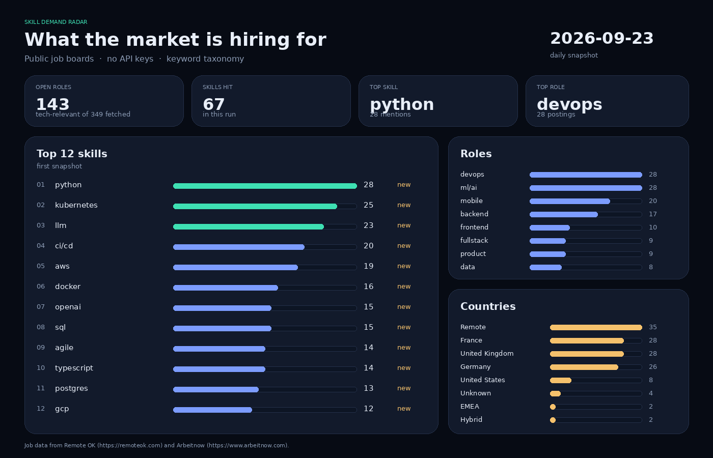
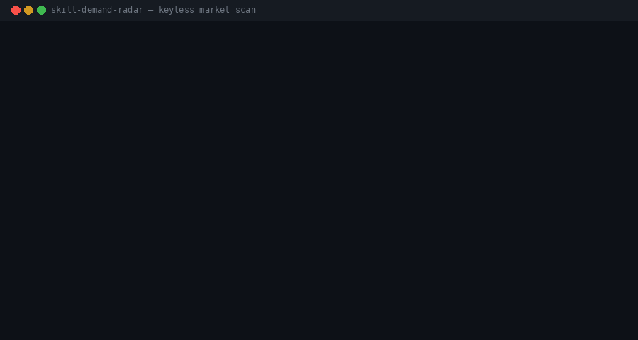

# Skill Demand Radar

**What skills does the market actually want? A radar that measures it daily — no API keys, no scraping fight.**

[](LICENSE)
[](https://www.python.org/)
[-3ee0b3.svg)](#data-sources)
[](.github/workflows/update.yml)




A public, stdlib-only Python radar that reads **keyless job APIs**, extracts a transparent skill taxonomy, and publishes a **static dashboard**. Recruiters can open `docs/index.html` — nothing to configure, nothing to log in to.

No pip dependencies for the radar itself. No `.env`. No personal data.

---

## Why

Hiring conversations still run on vibes: “everyone wants Rust”, “Python is over”, “AI replaced SQL”.

Those claims are cheap. **Counts are not.**

This repo turns two public job boards into a daily scoreboard:

- Which skills appear in real postings
- Which role buckets they cluster into
- Which countries (or Remote) they come from
- How today’s counts moved versus yesterday

It is a radar, not a ranking of people. The unit of measure is **the posting**.

## How it works

```
  Arbeitnow API              RemoteOK API
  JSON, keyless              JSON, keyless
         │                         │
         └────────────┬────────────┘
                      ▼
              extract skills
           (keyword taxonomy)
              classify roles
                      │
                      ▼
           aggregate + history
         snapshot  →  deltas
                      │
          ┌───────────┴───────────┐
          ▼                       ▼
   docs/index.html          docs/report.md
   static dashboard         markdown digest
```

1. **Fetch** public JSON (`urllib`). If a source is down, the bundled `data/sample_jobs.json` keeps the pipeline green.
2. **Extract** ~70 canonical skills (python, typescript, kubernetes, rag, …) with word-boundary aliases.
3. **Classify** titles into mobile / backend / frontend / fullstack / data / ml/ai / devops / qa / product / design / other.
4. **Aggregate** counts, write `data/history/YYYY-MM-DD.json`, compute per-skill deltas vs the previous snapshot.
5. **Render** a self-contained HTML dashboard and a Markdown report. Optional PNG via Pillow.

## Quickstart

```bash
python3 main.py --all
```

Then open `docs/index.html` in a browser.

```bash
python3 main.py --fetch     # sources only
python3 main.py --report    # re-render from the latest snapshot
```

Python 3.10+ stdlib only (`urllib`, `json`, `re`, `html`, `collections`, `datetime`, `pathlib`, `argparse`, `statistics`).

```bash
# optional visuals (needs Pillow)
python3 tools/make_dashboard_png.py
python3 tools/make_demo_gif.py
```

## Data sources

| Source | Endpoint | Auth |
|:-------|:---------|:-----|
| [Arbeitnow](https://www.arbeitnow.com) | `https://www.arbeitnow.com/api/job-board-api` | none |
| [Remote OK](https://remoteok.com) | `https://remoteok.com/api` | none (`User-Agent: Mozilla/5.0`) |

Job data from Remote OK (https://remoteok.com) and Arbeitnow (https://www.arbeitnow.com).

RemoteOK requires attribution; both the dashboard footer and this README include it.

If the network is unavailable the CLI prints a warning and continues with `data/sample_jobs.json` (~40 invented-but-realistic postings).

## Deploy

GitHub Pages from `/docs`:

1. Push this repo (public).
2. Settings → Pages → Build and deployment → **Deploy from a branch**.
3. Branch: `main` / folder: `/docs`.

`.github/workflows/update.yml` runs at **06:00 UTC** every day (`workflow_dispatch` is also enabled): checkout, Python 3.12, `python3 main.py --all`, commit `docs/` + `data/history/` as `github-actions[bot]`.

## Project structure

```
skill-demand-radar/
  main.py                 # CLI: --fetch | --report | --all
  radar/
    fetchers.py           # Arbeitnow + RemoteOK + sample fallback
    taxonomy.py           # SKILLS, ROLE_PATTERNS, location maps
    extract.py            # extract_skills / classify_role
    aggregate.py          # counts, history, deltas
    report.py             # HTML dashboard + Markdown
  data/
    sample_jobs.json      # bundled fallback corpus
    history/              # YYYY-MM-DD.json snapshots
  docs/
    index.html            # generated dashboard
    report.md             # generated digest
  tools/
    make_dashboard_png.py # PNG from real aggregates (Pillow)
    make_demo_gif.py      # terminal GIF (Pillow)
  assets/
    dashboard.png
    demo.gif
  .github/workflows/update.yml
```

## Limitations

- **Keyword taxonomy.** Skills that are implied but never named (e.g. “scale our marketplace” without “kafka”) are under-counted.
- **Source bias.** RemoteOK is remote-first. Arbeitnow leans European and mixes in non-tech posts (sales, HR, translators); those are dropped unless a hard skill or tech title is present.
- **Small daily sample.** A few hundred posts, not every board on earth. Treat the numbers as a weather report, not a census.
- **Role regexes.** “Python engineer” becomes backend; a research scientist who writes Python may land in other / ml/ai depending on the title.
- **Deltas need history.** The first snapshot has no yesterday. Day two is when arrows appear.

## Roadmap

- More keyless sources (public RSS / board dumps)
- Skill adjacency (“python jobs also mention X”)
- Role × skill matrix for recruiters
- Weekly sparkline in the dashboard (still no JS frameworks)
- Optional language filter (EN / DE / ES / PT)

## License

[MIT](LICENSE) — Copyright (c) 2026 Sergio Lim.
